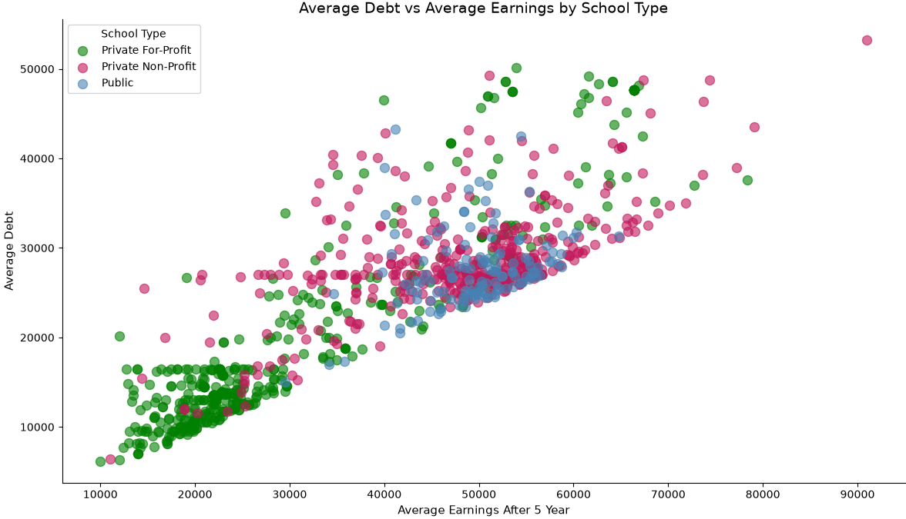

# Student Performance Project
 
This project examines projected earnings for male and female students after college graduation. The project will explore which degree has the highest payoff and whether men or women fare better in salary. It will also explore whether recipients of Pell Grants (grants given to students with dire financial need) are able to obtain the same salaries as those without and whether variances are degree specific. The findings of this project will determine the best places to allocate federal funding for future students, aiding incoming freshmen as they decide where to attend school and what to study. As AI looms upon us all, this is ever more prevalent.
 
## How to Use
1. Clone this repository.
2. Create and activate a virtual environment
   - python -m venv venv
   - source venv/Scripts/activate
2. Install the required Python packages:  
   pip install -r requirements.txt
3. Open `student_performance_data_project.ipynb` in Jupyter Notebook or JupyterLab.
 
 
## Data Sources
### Most Recent Cohorts By Institution
- **Source:** U.S. Department of Education — College Scorecard
- **Link:** https://collegescorecard.ed.gov/data/
- **Fields:** INSTNM, UGDS_MEN, UGDS_WOMEN, PCTPELL, TUITIONFEE_IN, TUITIONFEE_OUT, 
  MD_EARN_WNE_P10, NPT4_PUB, NPT4_PRIV, C150_4

### Most Recent Cohorts By Field of Study
- **Source:** U.S. Department of Education — College Scorecard
- **Link:** https://collegescorecard.ed.gov/data/
- **Fields:** CIPCODE, CIPDESC, CREDLEV, DEBT_ALL_STGP_ANY_MDN, DEBT_MALE_STGP_ANY_MDN, 
  DEBT_NOTMALE_STGP_ANY_MDN, EARN_MALE_WNE_MDN_1YR, EARN_MALE_WNE_MDN_4YR, 
  EARN_NOMALE_WNE_MDN_1YR, EARN_NOMALE_WNE_MDN_4YR, EARN_PELL_WNE_MDN_1YR, 
  EARN_NOPELL_WNE_MDN_1YR

### IPEDS C2024A Completions
- **Source:** National Center for Education Statistics (NCES)
- **Link:** https://nces.ed.gov/ipeds/datacenter/DataFiles.aspx
- **Fields:** UNITID, CIPCODE, AWLEVEL, CTOTALW, CTOTALM, CTOTALT

### C2024a
- **Source:** National Center for Education Statistics
- **Link:** https://nces.ed.gov/ipeds/datacenter/DataFiles.aspx
- **Fields:** UNITID, CIPCODE, AWLEVEL, CTOTALW ,CTOTALM, CTOTALT

## Research Objectives

**Primary Questions:**
- Do men or women make more money in the same degrees post-graduation?
- What is the debt-to-income ratio per degree? Per school?
- Do men or women acquire more awards during schooling?

**Secondary Questions:**
- Is there any effect of Pell grants on the outcome of earnings?
- What is the difference for men and for women?

## Analysis 

I really designed this project to determine which schools and degrees offer the best bang for their buck. In other words, which school garners an individual the highest salary with the least amount of debt. What I learned through completing this project is that Public universities consistently offer the least amount of debt coupled with the highest earnings. They don't necessarily delivery the lowest debt overall (Private For-Profit schools do) but they do help students get a high salary. Private For-Profit schools might have a lower debt ratio but they also earn a student a lower salary.

I was not surprised but I was disappointed to learn that women do make less than men for similar degrees. The earning disparity is the greatest for higher level degrees including dentistry, nursing and business degrees. Dentistry has a whopping 60K income disparity. That's significant.

Women do win more awards though! Even though they have the highest income disparity. It was definitely good to see that women are being recognized. Women won 30 % more awards than men!

Recipients of a Pell Grant also had an earnings gap compared to those that did not receive one. The highest gap was for technical degrees including Computer Science, Chemistry and Legal degrees. HR also had a significant gap in earnings. This gap needs to be explored more to determine why it exists and what can be done to decrease it.

### Database Diagram

One institution can have many awards, one program can have many awards and one institution can have many programs. The primary key for the institutions table is the school id, the primary key for the awards table is the award_id, and the primary key for the programs table is program_id. Institutions are related to programs through a foreign key (school_id). Programs are related to awards through a foreign key (program_id).

### Chart

 
## Author
Chrissy Kongshaug