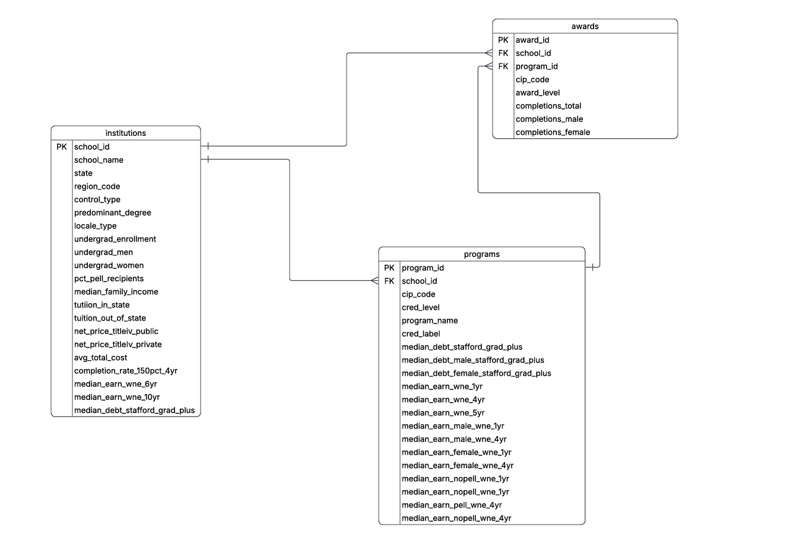

# Student Performance Project
 
This project examines projected earnings for male and female students after college graduation. The project will explore which degree has the highest payoff and whether men or women fare better in salary. It will also explore whether recipients of Pell Grants (grants given to students with dire financial need) are able to obtain the same salaries as those without and whether variances are degree specific. The findings of this project will determine the best places to allocate federal funding for future students, aiding incoming freshmen as they decide where to attend school and what to study. As AI looms upon us all, this is ever more prevalent.
 
## How to Use
1. Clone this repository.
2. Install the required Python packages:  
   pip install -r requirements.txt
3. Open `student_performance_data_project.ipynb` in Jupyter Notebook or JupyterLab.
 
## Analysis 
So far the analysis is showing that the Kaggle Datset is very synthetic and manufactured so I am switching to analyze a College Board dataset as you can see in my notebook and markdown cells
 
## Data Sources
### Most Recent Cohorts By Institution
- **Source:** U.S. Department of Education — College Scorecard
- **Link:** https://collegescorecard.ed.gov/data/
- **Fields:** INSTNM, UGDS_MEN, UGDS_WOMEN, PCTPELL, TUITIONFEE_IN, TUITIONFEE_OUT, 
  MD_EARN_WNE_P10, NPT4_PUB, NPT4_PRIV, C150_4

### Most Recent Cohorts By Field of Study
- **Source:** U.S. Department of Education — College Scorecard
- **Link:** https://collegescorecard.ed.gov/data/
- **Fields:** CIPCODE, CIPDESC, CREDLEV, DEBT_ALL_STGP_ANY_MDN, DEBT_MALE_STGP_ANY_MDN, 
  DEBT_NOTMALE_STGP_ANY_MDN, EARN_MALE_WNE_MDN_1YR, EARN_MALE_WNE_MDN_4YR, 
  EARN_NOMALE_WNE_MDN_1YR, EARN_NOMALE_WNE_MDN_4YR, EARN_PELL_WNE_MDN_1YR, 
  EARN_NOPELL_WNE_MDN_1YR

### IPEDS C2024A Completions
- **Source:** National Center for Education Statistics (NCES)
- **Link:** https://nces.ed.gov/ipeds/datacenter/DataFiles.aspx
- **Fields:** UNITID, CIPCODE, AWLEVEL, CTOTALW, CTOTALM, CTOTALT

## Research Objectives

**Primary Questions:**
- Do men or women make more money in the same degrees post-graduation?
- What is the debt-to-income ratio per degree? Per school?
- Do men or women acquire more awards during schooling?

**Secondary Questions:**
- Is there any effect of Pell grants on the outcome of earnings?
- What is the difference for men and for women?

C2024a
•	Source: National Center for Education Statistics
•	https://nces.ed.gov/ipeds/datacenter/DataFiles.aspx
•	Fields: UNITID, CIPCODE, AWLEVEL, CTOTALW ,CTOTALM, CTOTALT

### Database Diagram

### Chart

 
## Author
Chrissy Kongshaug